# 🎯 Automated Contribution Animation Setup

This repository now includes GitHub Actions automation to generate your contribution animation automatically, just like the snake animation!

## 🚀 How it works

1. **GitHub Actions runs daily** and on every push to main branch
2. **Fetches your real contribution data** from GitHub API  
3. **Generates animated SVG** with popping contribution boxes
4. **Auto-commits the SVG** back to your repository
5. **Your README displays** the always up-to-date animation

## 📁 Generated Files

The automation creates multiple SVG files:
- `{username}-contribution-animation.svg` - Personal filename
- `contribution-animation.svg` - Generic filename  
- `github-contribution-animation.svg` - Snake-style naming

## 🔧 Setup Instructions

### Option 1: Use in your own repository

1. **Copy the workflow file**:
   ```bash
   mkdir -p .github/workflows
   cp .github/workflows/generate-animation.yml .github/workflows/
   cp -r scripts/ ./
   ```

2. **Add to your README.md**:
   ```markdown
   
   ```

3. **Push to trigger first generation**:
   ```bash
   git add .
   git commit -m "Add automated contribution animation"
   git push
   ```

4. **Wait for GitHub Actions** to run (check Actions tab)

### Option 2: Use this repository's animation

Simply reference the animation from this repo in your README:

```markdown

```

## ⚙️ Customization

Edit `scripts/generate-svg.js` to customize:
- 🎨 **Colors**: Modify the `getContributionColor()` function
- ⏱️ **Animation speed**: Adjust `animationDuration` calculation  
- 📏 **Size**: Change `svgWidth` and `svgHeight`
- 🎭 **Animation style**: Modify CSS keyframes

## 🔄 Schedule

- **Daily at 00:00 UTC**: Automatic update
- **On every push**: Immediate update
- **Manual trigger**: From Actions tab

## 📊 Features

✅ **Real GitHub data** - Uses actual contribution counts  
✅ **Animated popping** - Contribution boxes explode in sequence  
✅ **Auto-updating** - Always shows latest contributions  
✅ **Zero maintenance** - Runs completely automatically  
✅ **Multiple formats** - Various filename options  
✅ **Fast loading** - Optimized SVG animations

---

🎯 **Powered by**: [Contribution Canon](https://man0dya.github.io/contribution-canon/)