# 🎯 Contribution Canon

Transform your GitHub contribution graph into an epic animated display! Watch as your contributions pop and explode with spectacular effects, creating a dynamic visualization perfect for your README.


---

## � For Users

### 🚀 Quick Setup (2 Minutes)

#### Method 1: Automated Animation (Recommended)
**Just like the GitHub Snake animation - set it and forget it!**

1. **Copy automation files to your repository:**
   ```bash
   curl -L https://raw.githubusercontent.com/Man0dya/contribution-canon/main/.github/workflows/generate-animation.yml -o .github/workflows/generate-animation.yml
   curl -L https://raw.githubusercontent.com/Man0dya/contribution-canon/main/scripts/generate-svg.cjs -o scripts/generate-svg.cjs
   ```

2. **Add this line to your README.md:**
   ```markdown
   
   ```

3. **Commit and push:**
   ```bash
   git add .
   git commit -m "Add automated contribution animation"
   git push
   ```

**✨ That's it!** Your animation will:
- 🔄 Generate automatically every day at midnight UTC
- 📊 Use your real GitHub contribution data
- 🎯 Update whenever you push new code
- ⚡ Require zero maintenance

#### Method 2: Manual Generation

1. Visit **[Contribution Canon Website](https://man0dya.github.io/contribution-canon)**
2. Enter your GitHub username
3. Customize your animation (theme, size, speed)
4. Click **"Download SVG"**
5. Save the file in your repository as `contribution-animation.svg`
6. Add to your README:
   ```markdown
   
   ```

### 🎨 Customization Options

- **Themes**: Default, GitHub, Ocean, Sunset
- **Sizes**: Small (600×150), Medium (800×200), Large (1000×250)  
- **Animation Speed**: Slow, Normal, Fast
- **Real-time Preview**: See changes instantly

### 📱 Where to Use

- ✅ GitHub Profile README
- ✅ Repository documentation
- ✅ Personal websites
- ✅ Portfolio projects
- ✅ Social media profiles

### 🔧 Troubleshooting

**Animation not showing?**
- Ensure the SVG file is committed to your repository
- Check that the file path in your markdown is correct
- Verify your GitHub username is spelled correctly

**Animation not updating?**
- The automation runs daily - check back after 24 hours
- Ensure the workflow file has proper permissions
- Check the Actions tab in your repository for any errors

---

## 👩‍� For Developers

### 🛠️ Local Development Setup

1. **Clone and install:**
   ```bash
   git clone https://github.com/Man0dya/contribution-canon.git
   cd contribution-canon
   npm install
   ```

2. **Start development server:**
   ```bash
   npm run dev
   ```
   Visit `http://localhost:5173` to see the app running locally.

3. **Build for production:**
   ```bash
   npm run build
   npm run preview  # Test production build locally
   ```

### 🏗️ Project Architecture

```
contribution-canon/
├── .github/workflows/
│   └── generate-animation.yml    # GitHub Actions automation
├── scripts/
│   └── generate-svg.cjs          # SVG generation script  
├── src/
│   ├── components/
│   │   ├── Header.jsx            # Site header
│   │   ├── UsernameForm.jsx      # Username input form
│   │   ├── CannonAnimation.jsx   # Main animation component
│   │   ├── CodeGenerator.jsx     # SVG generator & customization
│   │   └── Footer.jsx            # Site footer
│   ├── utils/
│   │   └── github.js             # GitHub API utilities
│   ├── App.jsx                   # Root component
│   ├── main.jsx                  # React entry point
│   └── index.css                 # Global styles
├── public/                       # Static assets
├── package.json                  # Dependencies & scripts
└── README.md                     # This file
```

### 🧰 Tech Stack

- **Frontend Framework**: React 18 + Vite
- **Styling**: Tailwind CSS + Custom CSS animations
- **Animations**: Framer Motion for UI, CSS for SVG
- **Icons**: Lucide React
- **API**: GitHub GraphQL API
- **Deployment**: GitHub Pages
- **Automation**: GitHub Actions + Node.js

### 🔧 Environment Setup

Create `.env` file for development:
```env
VITE_GITHUB_TOKEN=ghp_your_token_here  # Optional: Higher API limits
VITE_BASE_URL=http://localhost:5173    # Development URL
```

### 🚀 Deployment

**GitHub Pages (Automatic):**
```bash
npm run deploy
```

**Manual deployment:**
```bash
npm run build
# Upload dist/ folder to your hosting provider
```

### 🤝 Contributing

We welcome contributions! Here's how to get started:

#### � Bug Reports
1. Check [existing issues](https://github.com/Man0dya/contribution-canon/issues)
2. Create detailed issue with:
   - Steps to reproduce
   - Expected vs actual behavior  
   - Screenshots/videos if applicable
   - Environment details (browser, OS)

#### ✨ Feature Requests
1. Open an issue with the `enhancement` label
2. Describe the feature and its use case
3. Include mockups or examples if possible

#### 🔄 Pull Request Process
1. **Fork the repository**
2. **Create feature branch:**
   ```bash
   git checkout -b feature/amazing-new-feature
   ```
3. **Make your changes:**
   - Follow existing code style
   - Add comments for complex logic
   - Update documentation if needed
4. **Test thoroughly:**
   ```bash
   npm run dev    # Test in development
   npm run build  # Ensure production build works
   ```
5. **Commit with clear messages:**
   ```bash
   git commit -m "feat: add new animation theme"
   ```
6. **Push and create Pull Request:**
   ```bash
   git push origin feature/amazing-new-feature
   ```

#### 💡 Contribution Ideas

**Easy (Good First Issues):**
- Add new color themes
- Improve error messages
- Add loading animations
- Enhance mobile responsiveness

**Medium:**
- Add new animation patterns
- Implement sound effects (toggleable)
- Add GitHub stats integration
- Create animation presets

**Advanced:**
- Performance optimizations
- Advanced SVG animations
- Custom animation editor
- Real-time collaboration features

### 📊 Development Scripts

```bash
npm run dev        # Start development server
npm run build      # Build for production
npm run preview    # Preview production build
npm run deploy     # Deploy to GitHub Pages
npm run lint       # Run ESLint
npm run format     # Format code with Prettier
```

### 🔍 Code Style Guidelines

- Use **functional components** with hooks
- Follow **ESLint** and **Prettier** configurations
- Write **descriptive commit messages** (conventional commits)
- Add **JSDoc comments** for complex functions
- Use **TypeScript** for new features (migration in progress)

### 🧪 Testing

Currently using manual testing. Contributions welcome for:
- Unit tests (Jest + React Testing Library)
- Integration tests
- E2E tests (Playwright/Cypress)
- Visual regression tests

---

## � License

This project is licensed under the **MIT License** - see the [LICENSE](LICENSE) file for details.

## 🙏 Acknowledgments

- Inspired by [GitHub Snake](https://github.com/Platane/snk) by @Platane
- GitHub for providing contribution data via their API
- The React and Vite communities for excellent tooling
- All contributors who help improve this project

## 🆘 Support

- 📖 **Documentation**: Check this README and inline code comments
- 🐛 **Bug Reports**: [GitHub Issues](https://github.com/Man0dya/contribution-canon/issues)
- 💬 **Discussions**: [GitHub Discussions](https://github.com/Man0dya/contribution-canon/discussions)
- ⭐ **Show Support**: Star the repository if you find it useful!

---

**Transform your GitHub profile today! 🎯✨**